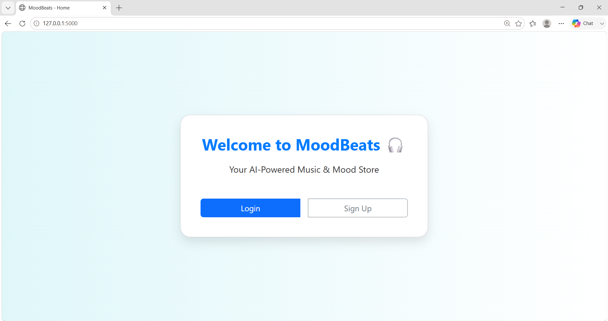
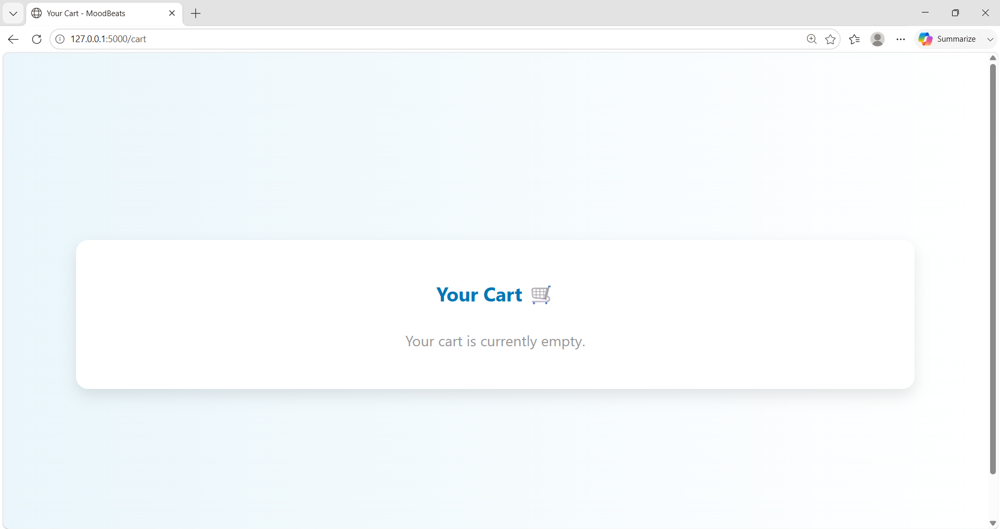

# MoodBeats 🎵🛍️

MoodBeats is an AI-powered web application that recommends songs and products based on the user’s real-time emotions. It uses facial emotion detection to personalize the user experience and integrates music recommendations with product suggestions into a single platform.

## Features

- Emotion-based song recommendations
- Product recommendations based on detected mood
- Facial emotion detection
- Music personalization experience
- E-commerce product suggestions
- Interactive web interface
- Mood-based user engagement through AI recommendations
- User login and signup system
- Admin dashboard for managing products and users
- Shopping cart and order history functionality
- Mood-based personalized product browsing

## Tech Stack

- Python
- Flask
- HTML
- CSS
- JavaScript
- SQLite

## Project Structure

## Project Structure

- `run.py` – Entry point of the application
- `app/routes.py` – Application routes
- `app/emotion_detect.py` – Emotion detection logic
- `app/database.py` – Database handling
- `app/templates/` – HTML templates
- `app/static/` – CSS, JS, images
- `screenshots/` – Project screenshots for README
- `MoodBeats-Demo.mp4` – Project demo video
- `moodbeats.db` – SQLite database file

## How It Works

1. The user interacts with the MoodBeats web application.
2. The system detects the user's emotion using facial emotion detection.
3. Based on the detected emotion, the application recommends suitable songs.
4. It also suggests related products to enhance the user experience.
5. Users can browse recommended products, add items to cart, and place orders.
6. Admin can manage products and users through the admin dashboard.

## Installation and Setup

1. Clone the repository:

   ```bash
   git clone https://github.com/shreyaa2408/moodbeats.git
   ```

2. Move into the project folder:

   ```bash
   cd moodbeats
   ```

3. Install dependencies:

   ```bash
   pip install -r requirements.txt
   ```

4. Run the application:

   ```bash
   python run.py
   ```

5. Open the local server URL in your browser.

## Admin Login

- **Username:** admin
- **Password:** admin123

## Screenshots

### Home Page


### User Dashboard


### Recommended Products


### Cart Page


### My Orders


### Login Page


### Sign Up Page


### Admin Dashboard


## Demo Video

[▶ Watch MoodBeats Demo](MoodBeats-Demo.mp4)
## Future Scope

- Real-time webcam-based emotion detection
- Improved music recommendation engine
- Better product recommendation system
- User authentication and personalized profiles
- Integration with music streaming APIs
- Enhanced UI/UX for a more immersive experience

## Author

**Shreya**
